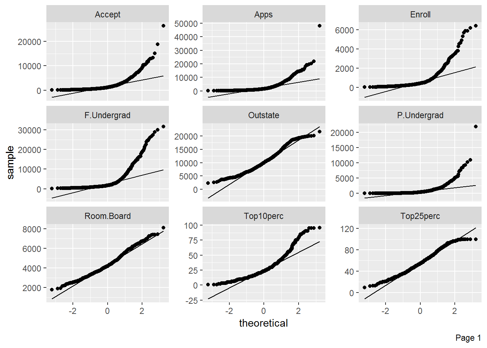
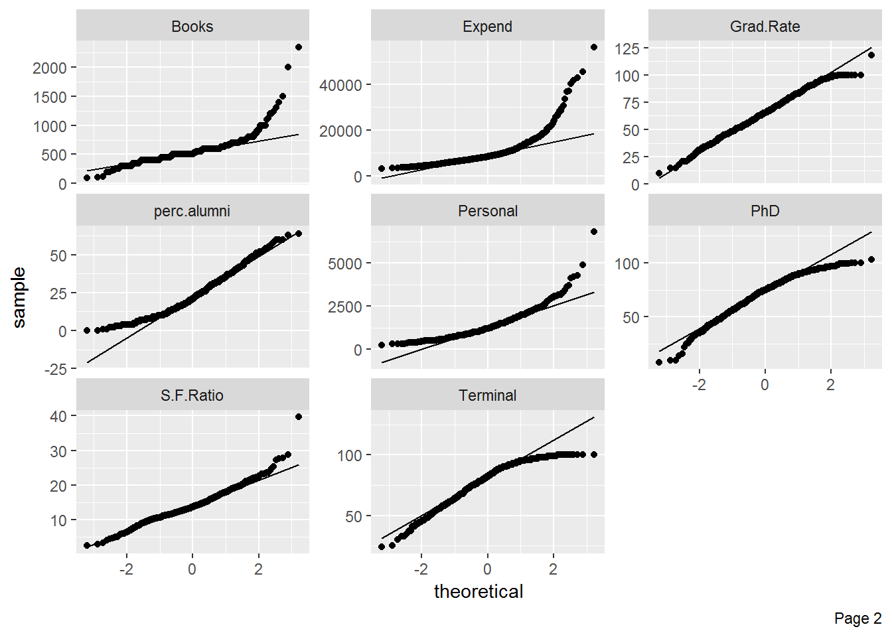
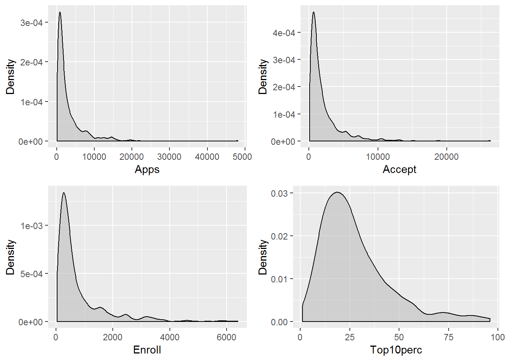
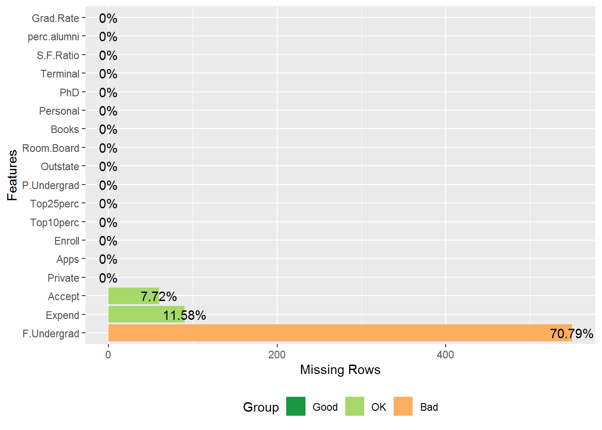
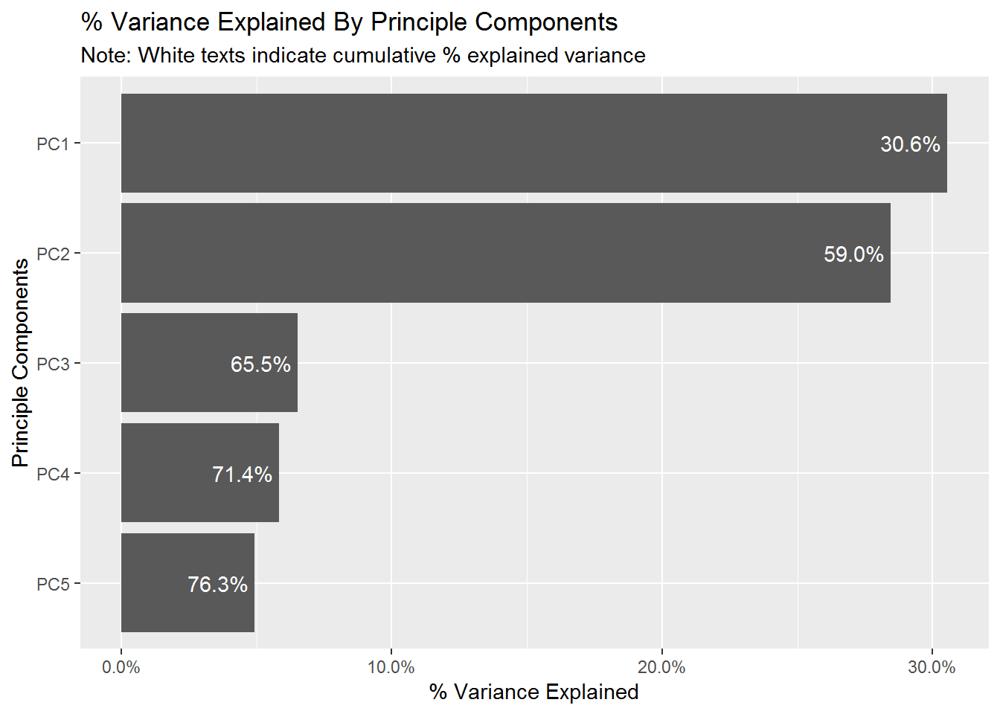
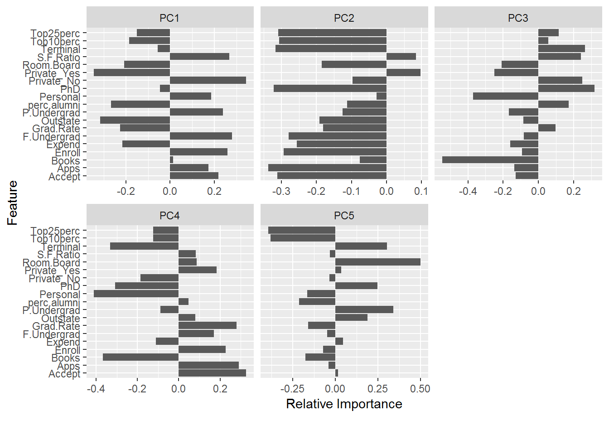

Revisiting College Graduation Rate Data
---------------------------------------

### A Faster EDA Using DataExplorer

As I am working with different datasets, prior to fitting a model, I've noticed that a lot of time has been spent of explorartory data analysis (EDA). The EDA step includes looking at the characteristics of the variables, and cleaning or structuring the dataset in way that's easy to work with. This is critical process, especially when using parametric modeling methods where certain assumptions have to be met.

In searching for ways to do EDA more efficiently, I discovered the `DataExplorer` library. The library contains functions that automates some of the common tasks in EDA, such as constructing histograms for continuous variables, and bar plots for categorical variables.

Here, the College Graduation Rate data from the `ISLR` library is used to demonstrate some of the functions in the `DataExplorer` library. To begin, the `introduce()` function shows a short summary of the dataset.

    ##   rows columns discrete_columns continuous_columns all_missing_columns
    ## 1  777      18                1                 17                   0
    ##   total_missing_values complete_rows total_observations memory_usage
    ## 1                    0           777              13986       113752

There are different plotting functions in the library for graphical analyses with a single line of code. For example, the `plot_qq()` function outputs the QQ-plots from all numerical variables.

``` r
plot_qq(college)
```



The the `plot_density()` function outputs the density plots from all numerical variables. Below is an example of the first 4 numerical variables. The appearances of the plots can be customized within the function, the options depend on the type of the plots.

``` r
plot_density(college[, c(2:5)], ncol=2, ggtheme = theme_gray(), 
             geom_density_args = list('fill'='grey',
                                      'alpha'=0.6))
```



Another useful function is `plot_missing()`, which shows the percentage of missing values in each variable. From prior analyses, there are no missing values in the college dataset. A few observations removed to demonstrate the function.

``` r
#removing random data in dataset
college.missing <- college
college.missing$Accept[sample(c(4:700), size=60, replace = FALSE)] <-rep(NA,60)
college.missing$F.Undergrad[sample(c(4:700), size=550, replace = FALSE)] <-rep(NA,550)
college.missing$Expend[sample(c(4:700), size=90, replace = FALSE)] <-rep(NA,90)

plot_missing(college.missing)
```



While these one-line functions can save a lot of time in EDA. The most powerful function in the library is the `create_report()` function. The default report, which can be called by using `create_report(college)`, contains output from functions like `plot_str()`, `plot_histogram()`, and other useful graphical analyses techniques. Additional plots with different options can be generated as shown below (see the [report](https://github.com/hminluo/RegressionAnalysis/blob/master/college_EDA_report.pdf) generated).

``` r
test<-create_report(data = college, y='Grad.Rate',
                    output_file = "college_EDA_report.html",
                    output_dir = getwd(),
                    config = list("introduce" = list(),"plot_missing" =list(),
                                  "plot_histogram" = list(),
                                  "plot_qq"=list(),
                                  "plot_bar" = list(),
                               "plot_correlation"=list("cor_args"=
                                                 list("use"="pairwise.complete.obs")),
                                  "plot_prcomp" = list(),
                                  "plot_boxplot" = list()))
```

The DataExplorer speeds up the EDA process by simplifying the codes for generating plots used for analysese. The analysis part of EDA still relies on the analysts. The results from the library should be examinate carefully to extract meaningful insights.

In PCA plot, as shown below (or in the report), the categorical variable, `Private`, is also included. Though PCA is mostly used with continuous variables.

``` r
plot_prcomp(college)
```


