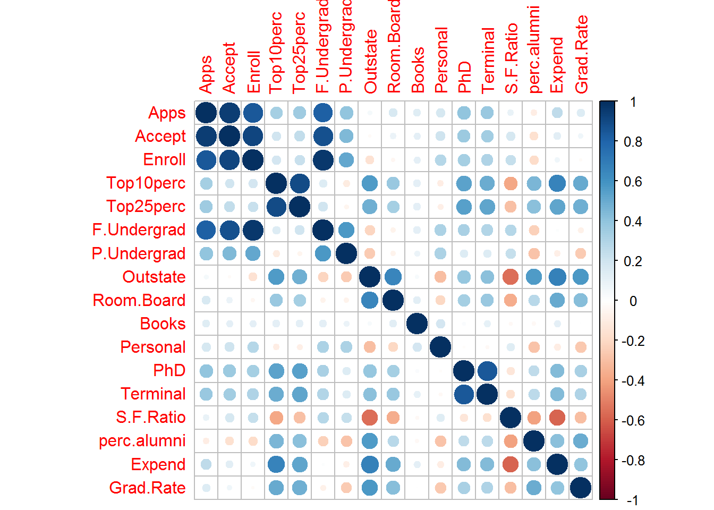
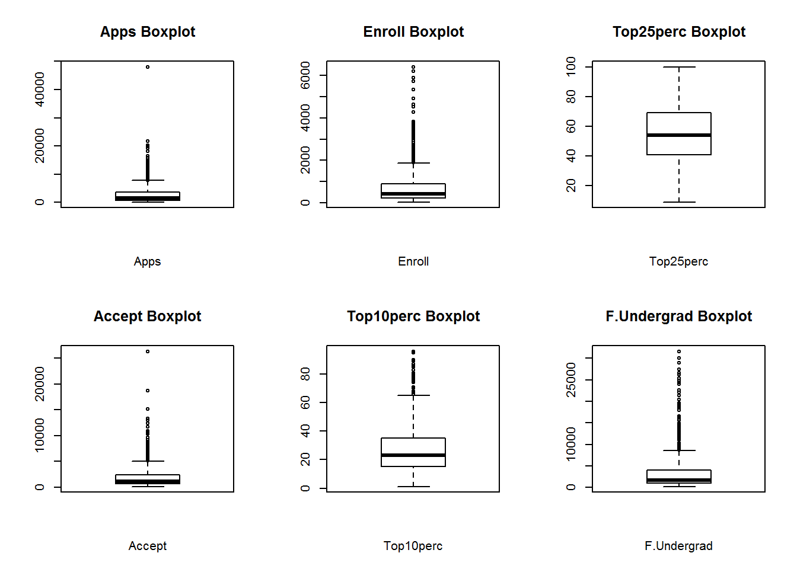
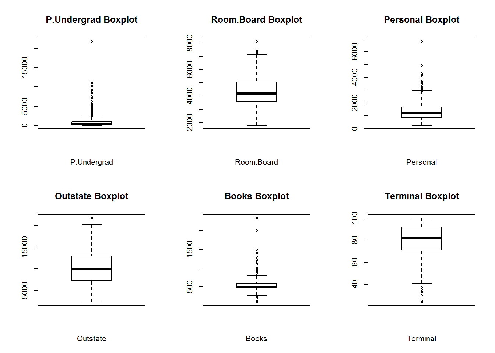
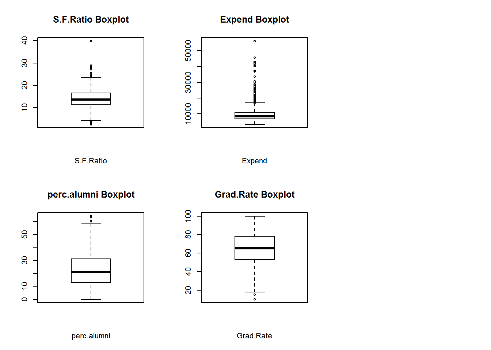
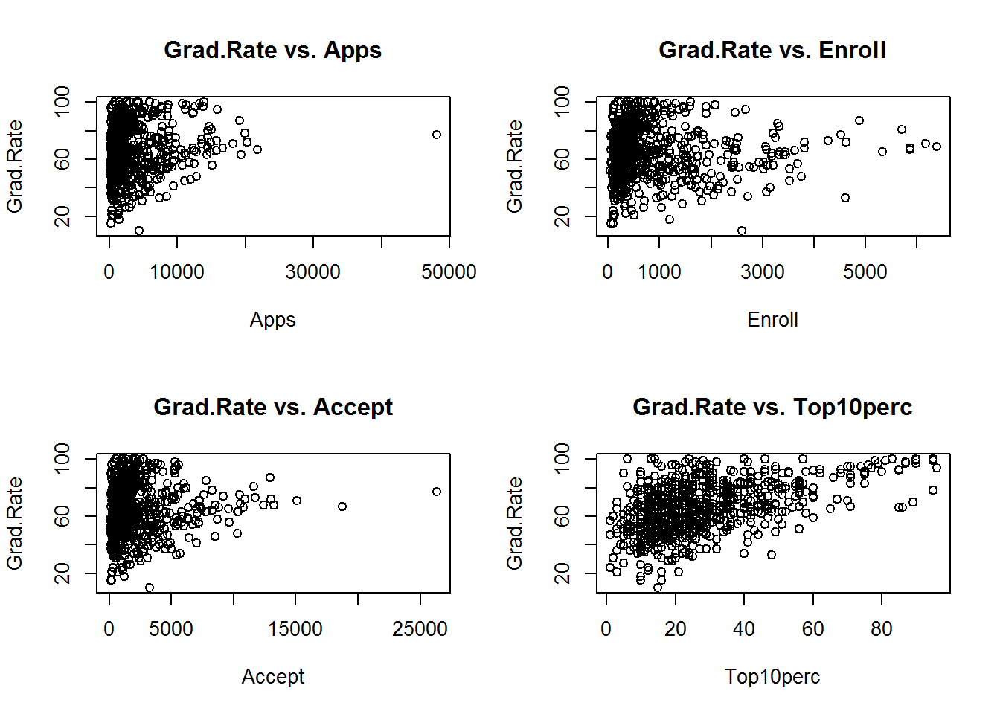
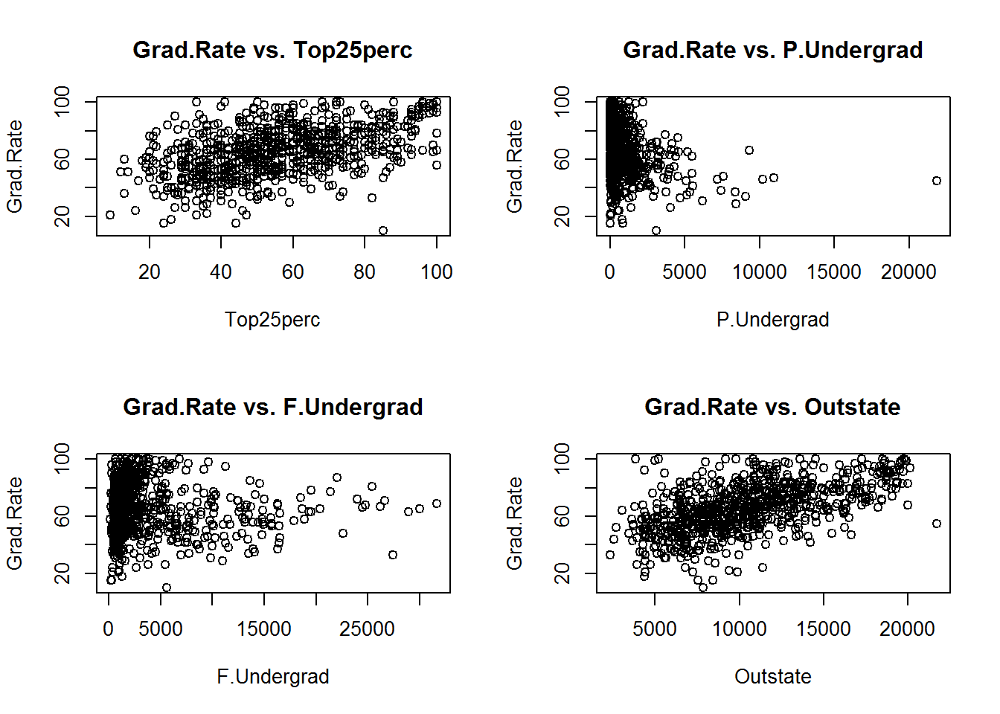
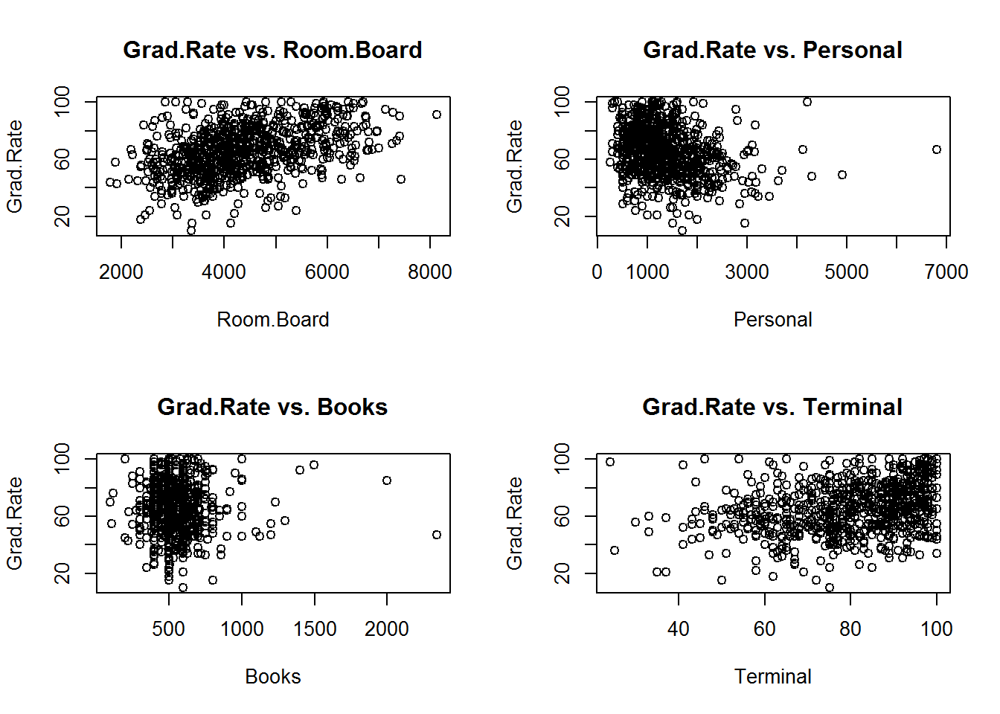
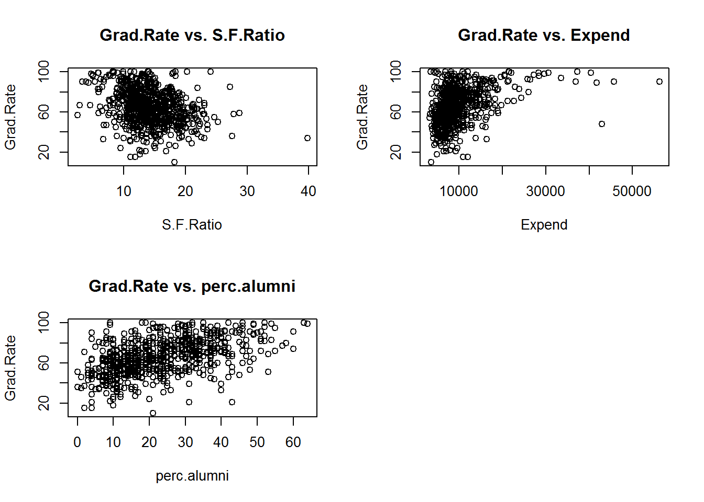
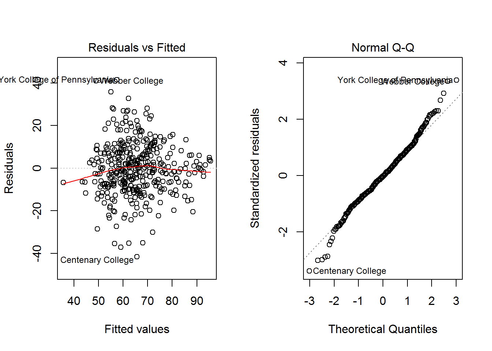
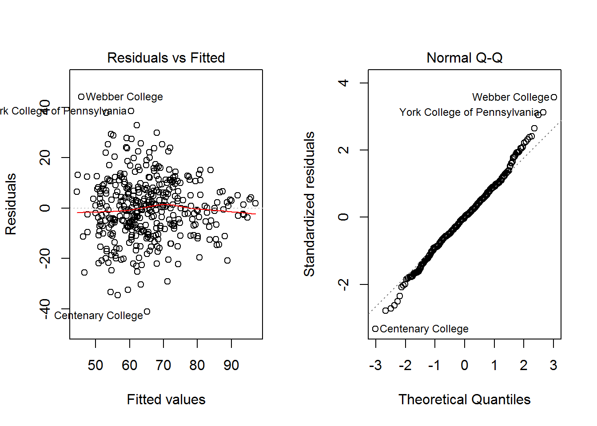

Regression Analysis on College Graduation Rate
----------------------------------------------

### Introduction

For this project, the US News and World Reports College Data from the StatLib library dataset is analyzed. Multiple regression models with the graduation rate as the dependent variable were fitted. Using stepwise selection, variables for the model were selected from the 17 predictor variables in the dataset, such as number of full-time students, and out-of-state tuition. By analysing the relationships between the dependent and independent variables, graduation rate of a university can be predicted based on the model fitted.

### Data Description and Exploratory Analysis

This project uses the college data from the 1995 issue of US News and World Report; the dataset cotains statistics for a large amount of colleges. The dataset can be accessed from the `ISLR` package in R as follows.

``` r
college <- ISLR::College
```

The college dataset has 777 observations and 18 variables, where 1 variable, Private, is categorical with two levels, and the others are numerical. The variables and their descriptions are shown below. In this project, the Grad.Rate variable (graduation rate) is the independent variable.

-   `Private` A factor with levels No and Yes indicating private or public university
-   `Apps` Number of applications received
-   `Accept` Number of applications accepted
-   `Enroll` Number of new students enrolled
-   `Top10perc` Pct. new students from top 10% of H.S. class
-   `Top25perc` Pct. new students from top 25% of H.S. class
-   `F.Undergrad` Number of fulltime undergraduates
-   `P.Undergrad` Number of parttime undergraduates
-   `Outstate` Out-of-state tuition
-   `Room.Board` Room and board costs
-   `Books` Estimated book costs
-   `Personal` Estimated personal spending
-   `PhD` Pct. of faculty with Ph.Ds
-   `Terminal Pct.` of faculty with terminal degree
-   `S.F.Ratio` Student/faculty ratio
-   `perc.alumni` Pct. alumni who donate
-   `Expend` Instructional expenditure per student
-   `Grad.Rate`(IV) Graduation rate

### Data Cleaning

An overview of the dataset is obtained using `summary()` and `str()`. There is no missing data observed from the summary output.

``` r
summary(college)
##  Private        Apps           Accept          Enroll       Top10perc    
##  No :212   Min.   :   81   Min.   :   72   Min.   :  35   Min.   : 1.00  
##  Yes:565   1st Qu.:  776   1st Qu.:  604   1st Qu.: 242   1st Qu.:15.00  
##            Median : 1558   Median : 1110   Median : 434   Median :23.00  
##            Mean   : 3002   Mean   : 2019   Mean   : 780   Mean   :27.56  
##            3rd Qu.: 3624   3rd Qu.: 2424   3rd Qu.: 902   3rd Qu.:35.00  
##            Max.   :48094   Max.   :26330   Max.   :6392   Max.   :96.00  
##    Top25perc      F.Undergrad     P.Undergrad         Outstate    
##  Min.   :  9.0   Min.   :  139   Min.   :    1.0   Min.   : 2340  
##  1st Qu.: 41.0   1st Qu.:  992   1st Qu.:   95.0   1st Qu.: 7320  
##  Median : 54.0   Median : 1707   Median :  353.0   Median : 9990  
##  Mean   : 55.8   Mean   : 3700   Mean   :  855.3   Mean   :10441  
##  3rd Qu.: 69.0   3rd Qu.: 4005   3rd Qu.:  967.0   3rd Qu.:12925  
##  Max.   :100.0   Max.   :31643   Max.   :21836.0   Max.   :21700  
##    Room.Board       Books           Personal         PhD        
##  Min.   :1780   Min.   :  96.0   Min.   : 250   Min.   :  8.00  
##  1st Qu.:3597   1st Qu.: 470.0   1st Qu.: 850   1st Qu.: 62.00  
##  Median :4200   Median : 500.0   Median :1200   Median : 75.00  
##  Mean   :4358   Mean   : 549.4   Mean   :1341   Mean   : 72.66  
##  3rd Qu.:5050   3rd Qu.: 600.0   3rd Qu.:1700   3rd Qu.: 85.00  
##  Max.   :8124   Max.   :2340.0   Max.   :6800   Max.   :103.00  
##     Terminal       S.F.Ratio      perc.alumni        Expend     
##  Min.   : 24.0   Min.   : 2.50   Min.   : 0.00   Min.   : 3186  
##  1st Qu.: 71.0   1st Qu.:11.50   1st Qu.:13.00   1st Qu.: 6751  
##  Median : 82.0   Median :13.60   Median :21.00   Median : 8377  
##  Mean   : 79.7   Mean   :14.09   Mean   :22.74   Mean   : 9660  
##  3rd Qu.: 92.0   3rd Qu.:16.50   3rd Qu.:31.00   3rd Qu.:10830  
##  Max.   :100.0   Max.   :39.80   Max.   :64.00   Max.   :56233  
##    Grad.Rate     
##  Min.   : 10.00  
##  1st Qu.: 53.00  
##  Median : 65.00  
##  Mean   : 65.46  
##  3rd Qu.: 78.00  
##  Max.   :118.00
#------------------------------------------------------
str(college)
## 'data.frame':    777 obs. of  18 variables:
##  $ Private    : Factor w/ 2 levels "No","Yes": 2 2 2 2 2 2 2 2 2 2 ...
##  $ Apps       : num  1660 2186 1428 417 193 ...
##  $ Accept     : num  1232 1924 1097 349 146 ...
##  $ Enroll     : num  721 512 336 137 55 158 103 489 227 172 ...
##  $ Top10perc  : num  23 16 22 60 16 38 17 37 30 21 ...
##  $ Top25perc  : num  52 29 50 89 44 62 45 68 63 44 ...
##  $ F.Undergrad: num  2885 2683 1036 510 249 ...
##  $ P.Undergrad: num  537 1227 99 63 869 ...
##  $ Outstate   : num  7440 12280 11250 12960 7560 ...
##  $ Room.Board : num  3300 6450 3750 5450 4120 ...
##  $ Books      : num  450 750 400 450 800 500 500 450 300 660 ...
##  $ Personal   : num  2200 1500 1165 875 1500 ...
##  $ PhD        : num  70 29 53 92 76 67 90 89 79 40 ...
##  $ Terminal   : num  78 30 66 97 72 73 93 100 84 41 ...
##  $ S.F.Ratio  : num  18.1 12.2 12.9 7.7 11.9 9.4 11.5 13.7 11.3 11.5 ...
##  $ perc.alumni: num  12 16 30 37 2 11 26 37 23 15 ...
##  $ Expend     : num  7041 10527 8735 19016 10922 ...
##  $ Grad.Rate  : num  60 56 54 59 15 55 63 73 80 52 ...
```

Two incorrect records in the PhD and Grad.Rate variables are found. Both variables describe percentages, a value of over 100 is impossible. Hence, the observations with the error are removed.

``` r
#Cazenovia College with over 100% Grad.Rate, remove observation
college[college$Grad.Rate> 100,]
college <- college[college$Grad.Rate<=100,]

#Texas A&M University at Galveston has over 100% PhD, remove observation
college[college$PhD> 100,]
college <- college[college$PhD<=100,]
```

No other errors are observed.

A correlation plot of the quantitative variables are plotted using `corrplot()` from the `corrplot` library. Dark blue or dark red indicates a high correlation between the corresponding variables. The correlation matrix plot here shows there are highly correlated variables in the dataset, such as Apps and Accept, this suggests that multicolinearity exists.

``` r
cor <- cor(college[, which(names(college)!='Private')])
corrplot(cor,method='circle')
```



The PhD and Terminal variables contain redundant information, the PhD variable is dropped.

``` r
college$PhD <- NULL
```

The highly correlated variables with an absolute correlation of 0.75 or higher is identified using `findCorrelation()` from the `car` library.

``` r
#recalculate correlation matrix without PhD
cor<- cor(college[, which(names(college)!='Private')])
highlycorr<-findCorrelation(cor, cutoff=0.75)
highlycorr<-names(college)[highlycorr+1]
highlycorr
## [1] "Top10perc"   "F.Undergrad" "Apps"        "Accept"
```

To analyze the distribution of each quantitative variables, a boxplot is plotted for each variable. Multiple variables are skewed, for example, Apps and Enroll are skewed to the right. The independent variable, Grad.Rate appears approximately normal.

``` r
par(mfcol = c(2, 3))
for (ii in c(2:17)){
  boxplot(x = college[,ii], xlab=names(college[ii]),
          main=paste(names(college[ii]),'Boxplot', sep = ' '))
}
```



Scatter plots of Grad.Rate and each numerical dependent variable are use to explore the relationship between them. Grad.Rate's relationship with variables such as Apps, Accept, and P.Undergrad are difficult to observe due to the skewness of those variables. A moderately linear relationship could be seen with Top10perc, Top25perc, Outstate, Room.Board, and perc.alumni.

``` r
quan.vars<- colnames(college)[-c(1,length(colnames(college)))]
par(mfcol = c(2, 2))
for (name in quan.vars){
  plot(x = college[,name],y=college$Grad.Rate,xlab=name,
       ylab='Grad.Rate', 
       main=paste( 'Grad.Rate vs.',name, sep = ' '))  
}
```



### Data Split

Before building the model, the data is split into the training set, `college.train`, and the test set, `college.test`. Since the size of the dataset is adaquately large, a 50-50 split is employed here.

``` r
train_ind <- sample(seq_len(nrow(college)), 
                    size=floor(0.5*nrow(college)))
college.train <- college[train_ind,]
college.test <- college[-train_ind,]
```

### Variable Selection

A multiple linear regression model including all the dependent variables is fitted using `lm()`, and its summary is shown below. The adjusted *R*<sup>2</sup> is relatively low, suggesting the model does not explain a lot of the variability in the data, and hence not a good fit. Note that *R*<sup>2</sup> is not a reliable measure here, as it tends to increase with the number of dependent variables included in the model.

``` r
model <- lm(Grad.Rate~., data=college.train)
summary(model)
## 
## Call:
## lm(formula = Grad.Rate ~ ., data = college.train)
## 
## Residuals:
##     Min      1Q  Median      3Q     Max 
## -42.030  -7.071  -0.417   7.376  40.102 
## 
## Coefficients:
##               Estimate Std. Error t value Pr(>|t|)    
## (Intercept) 31.5321996  6.7779812   4.652 4.58e-06 ***
## PrivateYes   3.0743860  2.2207091   1.384 0.167065    
## Apps         0.0017333  0.0006493   2.669 0.007936 ** 
## Accept      -0.0012502  0.0011852  -1.055 0.292158    
## Enroll       0.0071089  0.0038684   1.838 0.066914 .  
## Top10perc   -0.0005838  0.1022760  -0.006 0.995449    
## Top25perc    0.1020557  0.0752129   1.357 0.175643    
## F.Undergrad -0.0014445  0.0006067  -2.381 0.017788 *  
## P.Undergrad -0.0011767  0.0007203  -1.634 0.103202    
## Outstate     0.0012753  0.0003331   3.829 0.000151 ***
## Room.Board   0.0016046  0.0008134   1.973 0.049279 *  
## Books       -0.0037294  0.0041085  -0.908 0.364616    
## Personal    -0.0006418  0.0011250  -0.571 0.568655    
## Terminal     0.0398631  0.0602506   0.662 0.508626    
## S.F.Ratio    0.1733769  0.2297738   0.755 0.450996    
## perc.alumni  0.2531932  0.0672947   3.762 0.000196 ***
## Expend      -0.0004082  0.0002578  -1.583 0.114208    
## ---
## Signif. codes:  0 '***' 0.001 '**' 0.01 '*' 0.05 '.' 0.1 ' ' 1
## 
## Residual standard error: 12.21 on 370 degrees of freedom
## Multiple R-squared:  0.4571, Adjusted R-squared:  0.4337 
## F-statistic: 19.47 on 16 and 370 DF,  p-value: < 2.2e-16
```

Before the variable selection process, as discussed previously, there are highly correlated variables in the dataset. To test that formly, the variance inflation factor (VIF) is computed. A VIF greater 10 indicates significant multicolinearity. Apps, Accept, Enroll, and F.Undergrad all have a VIF above 10. This aligns with the result from the correlation matrix. Apps, Accept, Top10perc, and F.Undergrad are removed from the model.

``` r
vif(model)
##     Private        Apps      Accept      Enroll   Top10perc   Top25perc 
##    2.514474   12.328428   16.378966   30.373157    8.385953    5.677359 
## F.Undergrad P.Undergrad    Outstate  Room.Board       Books    Personal 
##   22.441683    2.203545    4.278589    2.036132    1.127031    1.365707 
##    Terminal   S.F.Ratio perc.alumni      Expend 
##    1.982356    2.004449    1.828665    3.878158
#remove highly correlated variables
college[,highlycorr]<-NULL
college.train[,highlycorr]<-NULL
```

With the highly correlated variables removed, a multiple regression model is fitted as before.

``` r
model <- lm(Grad.Rate~., data=college.train)
summary(model)
## 
## Call:
## lm(formula = Grad.Rate ~ ., data = college.train)
## 
## Residuals:
##     Min      1Q  Median      3Q     Max 
## -42.686  -7.392  -0.260   7.170  41.215 
## 
## Coefficients:
##               Estimate Std. Error t value Pr(>|t|)    
## (Intercept)  2.862e+01  6.620e+00   4.323 1.97e-05 ***
## PrivateYes   2.791e+00  2.191e+00   1.274 0.203359    
## Enroll       2.840e-03  1.078e-03   2.635 0.008762 ** 
## Top25perc    1.074e-01  4.426e-02   2.427 0.015682 *  
## P.Undergrad -1.913e-03  6.775e-04  -2.823 0.005009 ** 
## Outstate     1.387e-03  3.116e-04   4.450 1.13e-05 ***
## Room.Board   1.940e-03  8.080e-04   2.401 0.016832 *  
## Books       -4.343e-03  4.156e-03  -1.045 0.296705    
## Personal    -7.952e-04  1.140e-03  -0.697 0.485979    
## Terminal     1.687e-02  6.018e-02   0.280 0.779408    
## S.F.Ratio    2.609e-01  2.312e-01   1.129 0.259832    
## perc.alumni  2.288e-01  6.556e-02   3.490 0.000542 ***
## Expend      -9.525e-05  2.194e-04  -0.434 0.664374    
## ---
## Signif. codes:  0 '***' 0.001 '**' 0.01 '*' 0.05 '.' 0.1 ' ' 1
## 
## Residual standard error: 12.39 on 374 degrees of freedom
## Multiple R-squared:  0.4353, Adjusted R-squared:  0.4172 
## F-statistic: 24.03 on 12 and 374 DF,  p-value: < 2.2e-16
```

For variable selection, two methods are explored here, stepwise selection and best subset.

The stepwise method with is used here to identify a subset of dependent variables for the model that minimizes the AIC. With `stepAIC()` from the `MASS` library, the function identifies a best model with 7 dependent variables using the default both-direction selection method, where the process starts with the backward selection method, add and remove new variables to the model, and evaluate the result.

``` r
step <- stepAIC(model, trace=0, direction = 'both')
step.vars <- names(step$coefficients)[-1]
```

A multiple regression model is fitted with the 7 variables identified.

    ## 
    ## Call:
    ## lm(formula = as.formula(paste("Grad.Rate~", paste(step.vars, 
    ##     collapse = "+"))), data = college.train)
    ## 
    ## Residuals:
    ##     Min      1Q  Median      3Q     Max 
    ## -41.689  -7.579  -0.345   7.408  41.523 
    ## 
    ## Coefficients:
    ##               Estimate Std. Error t value Pr(>|t|)    
    ## (Intercept) 26.7909724  4.8229446   5.555 5.24e-08 ***
    ## Enroll       0.0020447  0.0009697   2.109 0.035635 *  
    ## Top25perc    0.0984127  0.0414366   2.375 0.018045 *  
    ## P.Undergrad -0.0021014  0.0006533  -3.217 0.001408 ** 
    ## Outstate     0.0015132  0.0002773   5.457 8.76e-08 ***
    ## Room.Board   0.0018972  0.0007724   2.456 0.014489 *  
    ## S.F.Ratio    0.3082803  0.2028379   1.520 0.129386    
    ## perc.alumni  0.2434077  0.0644130   3.779 0.000183 ***
    ## ---
    ## Signif. codes:  0 '***' 0.001 '**' 0.01 '*' 0.05 '.' 0.1 ' ' 1
    ## 
    ## Residual standard error: 12.37 on 379 degrees of freedom
    ## Multiple R-squared:  0.4293, Adjusted R-squared:  0.4188 
    ## F-statistic: 40.74 on 7 and 379 DF,  p-value: < 2.2e-16

### Model Assumptions Diagnostic and Remedial Measures

There are 5 key model assumptions to check for a linear regression model:

-   **Linearity** The relationship between the idependent and dependent variables is linear (Rainbox test)
-   **Idependency of Error Term** There is no correlation in consecutive error terms (Durbin-Watson test)
-   **Homoscedasticity** The variance of the error term is constant (Breusch-Pagan test, Brown-Forsythe test)
-   **Normality of Error Term** The distribution of the error term is normal (Shapiro-Wilk test)
-   **Normality of Independent Variable** The distribution of the independent variable is normal (Shapiro-Wilk test)

Graphical inspection can provide insights on any potential assumption violations, formal testing is required to confirm the diagnostic results. The formal tests used in this project are listed above in parentheses.

The residuals vs. fitted plot shows that the variance of error term seems to be higher in the middle, heteroscedasticity may exist (Note: residual and error term are used interchangably here). From the QQ plot of the residuals, the distribution of the residuals appears approximately normal.

``` r
par(mfrow=c(1,2))
plot(model.1a, which=c(1,2))
```



The linear relationship between the independent variable and dependent variables can be inspected graphically with scatter plots, as shown in the EDA step. Enrollment and P.Undergradare are both right-skewed, transformation of the variable may be used as a remedial measure.

For formal testing, the tests used for testing each model assumption are listed above. Many of these tests are available in the `lmtest` library. The `assumption_test()` function is written to output the test resutls for each test in a table format.

The normality of the error term assumption is tested through the Shapiro-Wilk test. The p-value of 0.00481 is statisically significant at *α* = 0.01, and we reject the null hypothesis that the error term is normal. The test shows that the independent variable, Grad.Rate, is normally distributed.

``` r
assumption_test(model.1a)
## [1] "Grad.Rate~Enroll + Top25perc + P.Undergrad + Outstate + Room.Board + S.F.Ratio + perc.alumni"
##               Test Statistic     p-value
## Rainbow            0.9391432 0.667381165
## Shapiro-Wilk       0.9888741 0.004810568
## Breusch-Pagan     17.4458194 0.014736933
## Durbin-Watson      2.2034737 0.977894572
#normality check for independent variable
shapiro.test(college.train$Grad.Rate)
## 
##  Shapiro-Wilk normality test
## 
## data:  college.train$Grad.Rate
## W = 0.99243, p-value = 0.04715
```

The Breusch-Pagan test assumes that the model's error term is normal, which is not a case here. Hence, the Brown-Forsythe test is used to test for homoscedasticity instead. The `bf_group()` function is written to perform the test on each depedent variable in the model.

from the result of the Breusch-Pagan test, the p-values for Enroll and Top25perc are both less than *α* = 0.01, we reject the null hypothesis and conclude that the error terms are heteroscedastic with those two variables.

    ## [1] "Breush-Pagan Test"
    ## Variable    Test-Stat       P-value
    ## Enroll       11.9679       6e-04 
    ## Top25perc       9.5135       0.0022 
    ## P.Undergrad       0.0065       0.9356 
    ## Outstate       1.5248       0.2177 
    ## Room.Board       0.6289       0.4282 
    ## S.F.Ratio       0.2601       0.6103 
    ## perc.alumni       0.0037       0.9514

The key assumptions can also be tested using the `gvlma` library. The result aligns with what we have so far.

``` r
gvlma::gvlma(model.1a, alphalevel = 0.01)
## 
## Call:
## lm(formula = as.formula(paste("Grad.Rate~", paste(step.vars, 
##     collapse = "+"))), data = college.train)
## 
## Coefficients:
## (Intercept)       Enroll    Top25perc  P.Undergrad     Outstate  
##   26.790972     0.002045     0.098413    -0.002101     0.001513  
##  Room.Board    S.F.Ratio  perc.alumni  
##    0.001897     0.308280     0.243408  
## 
## 
## ASSESSMENT OF THE LINEAR MODEL ASSUMPTIONS
## USING THE GLOBAL TEST ON 4 DEGREES-OF-FREEDOM:
## Level of Significance =  0.01 
## 
## Call:
##  gvlma::gvlma(x = model.1a, alphalevel = 0.01) 
## 
##                        Value   p-value                   Decision
## Global Stat        1.734e+01 0.0016586 Assumptions NOT satisfied!
## Skewness           2.981e-01 0.5850680    Assumptions acceptable.
## Kurtosis           1.511e+01 0.0001016 Assumptions NOT satisfied!
## Link Function      1.936e+00 0.1641077    Assumptions acceptable.
## Heteroscedasticity 4.394e-04 0.9832759    Assumptions acceptable.
```

The non-normality and heteroscedasticity could possibly be by-products of the non-linear relationship in the Grad.Rate, Enroll, and P.Undergrad. Hence a transformance of Enroll and P.Undergrad are considered first.

Transformation of a variable can be used as a rememdial measure for the homoscedasticity assumption violation. Transformation often fixes normality violation as well. Box-Cox transformation is used to indentify the optimal lambda value for the transformation based on max log-likelihood. The optimal lambda is found to be -0.2 and 0.1 for Enroll and P.Undergrad, respectively. A convenient lambda of 0 is used for both variables, i.e. a log transformation.

A regression model with the transformed variables is fitted.

``` r
model.1b <- lm(as.formula(paste("Grad.Rate~", 
                                paste(t.vars, collapse = "+"))),
               data=college.train)
summary(model.1b)
## 
## Call:
## lm(formula = as.formula(paste("Grad.Rate~", paste(t.vars, collapse = "+"))), 
##     data = college.train)
## 
## Residuals:
##     Min      1Q  Median      3Q     Max 
## -41.183  -7.310  -0.032   7.486  44.219 
## 
## Coefficients:
##               Estimate Std. Error t value Pr(>|t|)    
## (Intercept)  2.038e+01  5.768e+00   3.534  0.00046 ***
## Top25perc    1.009e-01  4.329e-02   2.331  0.02026 *  
## Outstate     1.692e-03  2.874e-04   5.885 8.75e-09 ***
## Room.Board   1.129e-03  8.217e-04   1.374  0.17028    
## S.F.Ratio    2.095e-01  2.114e-01   0.991  0.32235    
## perc.alumni  3.182e-01  6.606e-02   4.817 2.11e-06 ***
## tEnroll      6.927e-01  9.467e-01   0.732  0.46479    
## tP.Undergrad 5.274e-01  5.646e-01   0.934  0.35089    
## ---
## Signif. codes:  0 '***' 0.001 '**' 0.01 '*' 0.05 '.' 0.1 ' ' 1
## 
## Residual standard error: 12.5 on 379 degrees of freedom
## Multiple R-squared:  0.4178, Adjusted R-squared:  0.407 
## F-statistic: 38.85 on 7 and 379 DF,  p-value: < 2.2e-16
assumption_test(model.1b)
## [1] "Grad.Rate~Top25perc + Outstate + Room.Board + S.F.Ratio + perc.alumni + tEnroll + tP.Undergrad"
##               Test Statistic     p-value
## Rainbow            0.9046193 0.754944081
## Shapiro-Wilk       0.9932521 0.080583427
## Breusch-Pagan     20.4944390 0.004595104
## Durbin-Watson      2.2415999 0.991413438
par(mfrow=c(1,2))
plot(model.1b, which = c(1,2))
```



However, with the transformed variables, heteroscedasticity still presents. Based on [Gauss-Markov Theorem](https://en.wikipedia.org/wiki/Gauss%E2%80%93Markov_theorem), the model will still work, though the estimators are no longer BLUE (Best Linear, Unbiased Estimator).

### Model Validation

With the regression model fitted above, graduation rates are predicted using the test set. Prediction errors are then calculated using the `forecast` library. The first output, ME (mean error), is the average of the errors, though it does not provide information on the magnitude of the errors.The RMSE (root-mean-squared error) is, on the other hand, more informative. The model RMSE and the prediction RMSE are relatively close, indicating the model is not overfitting.

    ## [1] "-------Model Evaluation--------"
    ##                    ME     RMSE      MAE      MPE     MAPE
    ## Test set 5.509652e-16 12.36719 9.512472 -4.92502 17.02131
    ## [1] "-------Prediction Evaluation--------"
    ##                 ME     RMSE      MAE       MPE     MAPE
    ## Test set -1.326672 13.76455 10.35575 -9.613048 20.50941

The low adjusted *R*<sup>2</sup> from the model indicates the model does not explain a majority of the variability in the data. Introducing additional varibles and different modeling methods can be investigated for a more accurate model.
